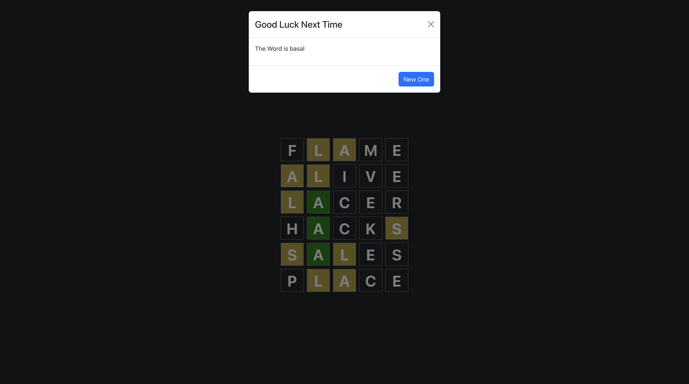

# Wordle

A clone of the popular Wordle game built with React and Bootstrap.

## Installation

1. Clone the repository:

   ```bash
   git clone https://github.com/Godliveanton/wordle.git
   cd wordle
   ```

2. Install dependencies on both frontend and backend (having two terminals will help):

   ```bash
   cd Frontend
   npm install
   ```

   ```bash
   cd Backend
   npm install
   ```

3. Start the development server on Backend and then on Frontend (having two terminals will help):
   ```bash
   node index.js
   ```
   ```bash
   npm start
   ```

## Usage

- Open your browser and go to `http://localhost:3000`
- Start playing the game by guessing the word!

## Technologies Used

- React
- Express
- MongoDB
- Bootstrap
- Axios

## Screenshots

### Game Interface


### Win


### Lost



### Error 1


### Error 2


## Contributing

Contributions are welcome! Please open an issue or submit a pull request.

## License

This project is licensed under the MIT License.
